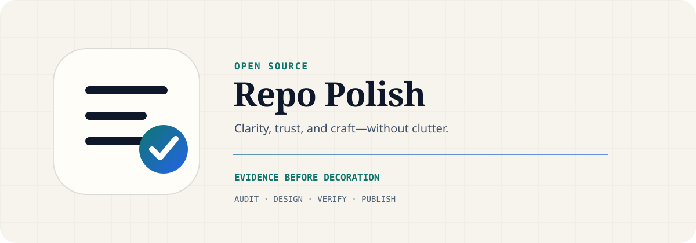

<picture>
  <source media="(prefers-color-scheme: dark)" srcset="assets/repo-polish-hero-dark.svg">
  <source media="(prefers-color-scheme: light)" srcset="assets/repo-polish-hero-light.svg">
  
</picture>

<div align="center">
  <a href="README.md">English</a> · <a href="README.zh-CN.md">简体中文</a>
</div>

<div align="center">
  <a href="https://github.com/Offwhite-Del/open-source-repo-polish/actions/workflows/ci.yml"></a>
  <a href="https://github.com/Offwhite-Del/open-source-repo-polish/releases"></a>
  <a href="LICENSE"></a>
  
</div>

Open Source Repo Polish is a cross-agent Skill for turning a functional repository into a clear, trustworthy, bilingual, and contribution-ready open-source project—without fake badges, copied branding, or decorative clutter.

> **Status:** `v0.1.1`. The bundled audit is local, read-only, zero-telemetry, and dependency-free beyond Node.js 18+.

## Why this Skill

Repository polish is not “make a pretty README.” It is the alignment of four surfaces:

| Surface | Question |
| --- | --- |
| Product truth | Can a visitor understand what the project does and does not do? |
| Onboarding | Can they reach a verified first result quickly? |
| Trust | Are evidence limits, security boundaries, maintenance status, and contribution paths explicit? |
| Visual hierarchy | Does the page guide attention without competing with the project itself? |

The Skill combines GitHub repository-health conventions with three original design lenses derived from public guidance:

- **Distinctive purpose:** choose a specific visual point of view instead of a generic AI template.
- **Technical warmth:** balance precision, geometry, and human-readable language.
- **Calm hierarchy:** favor clarity, consistency, accessibility, and restraint over decoration.

It does not copy Anthropic, OpenAI, or Apple logos, fonts, layouts, or protected brand assets.

## Quick start

### GitHub CLI

GitHub CLI 2.90+ can install the Skill into Codex, Claude Code, Copilot, Cursor, Gemini CLI, OpenCode, and many other supported agents:

```bash
gh skill install Offwhite-Del/open-source-repo-polish \
  open-source-repo-polish --agent codex --scope user
```

Replace `codex` with `claude-code`, `github-copilot`, `cursor`, or another supported host.

## Install as a plugin

### ChatGPT Desktop and Codex plugin

```bash
codex plugin marketplace add Offwhite-Del/open-source-repo-polish \
  --sparse .agents/plugins \
  --sparse plugins
codex plugin add repo-polish@repo-polish
```

Start a new task and invoke `$open-source-repo-polish`.

### Claude Code and Claude Code Desktop plugin

```bash
claude plugin marketplace add Offwhite-Del/open-source-repo-polish \
  --sparse .claude-plugin plugins
claude plugin install repo-polish@repo-polish
```

Reload plugins, then invoke `/repo-polish:open-source-repo-polish`.

## Use

Ask the Agent:

```text
Use open-source-repo-polish to audit this repository, propose the smallest
high-value improvements, apply the approved changes, and verify the result.
```

Or run the deterministic audit directly:

```bash
node plugins/repo-polish/skills/open-source-repo-polish/scripts/audit-repo.mjs \
  --root . --json
```

The script reads only known public repository surfaces. It does not read `.env`, authentication files, source code, private Agent transcripts, or secret values, and it does not access the network or change files.

## Example audit

```text
Open Source Repo Polish 0.1.1
Root: /path/to/repository
Local readiness: 86/100
Findings: 2
- [medium] missing-quick-start: The README has no recognized quick-start heading.
- [low] missing-pr-template: No pull-request template was found.
```

The score is a navigation aid. Review every finding against the project's maturity and maintenance capacity before adding files.

## Safety and privacy

- The script reads only recognized repository documentation and Git status.
- It never reads source code, `.env`, credentials, private Agent transcripts, or secret values.
- It never accesses the network or changes files.
- Remote GitHub facts are checked separately by the Agent and must not be inferred from local files.

## Workflow

1. Establish repository purpose, audience, current state, and release maturity.
2. Run the local audit and verify GitHub metadata separately.
3. Choose one intentional design direction suited to the project.
4. Separate facts, inferences, proposals, and blockers.
5. Apply the smallest coherent change set on a branch.
6. Render visual assets and validate links, tests, package contents, and secrets.
7. Publish through the repository's normal pull-request workflow.

The Skill stops when all in-scope findings are resolved or have one explicit blocker. A 100% checklist score is not permission to add more decoration.

## What the audit checks

- README, license, security, support, contribution, conduct, and changelog surfaces
- Issue and pull-request templates
- Quick start, installation, safety, evidence/demo, and bilingual navigation signals
- Hero/media presence, alt text, badges, and local link integrity
- Git branch and dirty-worktree state

The score is a **local readiness heuristic**, not GitHub's Community Profile score and not a quality guarantee.

## Project layout

```text
plugins/repo-polish/skills/open-source-repo-polish/
  SKILL.md                       On-demand workflow
  references/                    Design, health, and evaluation guidance
  scripts/audit-repo.mjs         Read-only deterministic audit
  agents/openai.yaml             Codex UI metadata
.agents/plugins/                 Codex marketplace
.claude-plugin/                  Claude marketplace
test/                            Audit behavior tests
```

## Development

```bash
npm test
npm run validate
gh skill publish --dry-run
claude plugin validate plugins/repo-polish
```

## Contributing

See [CONTRIBUTING.md](CONTRIBUTING.md), [SECURITY.md](SECURITY.md), and [CHANGELOG.md](CHANGELOG.md).

## License

Apache License 2.0. The linked third-party design guidance remains subject to its own terms and trademarks.
